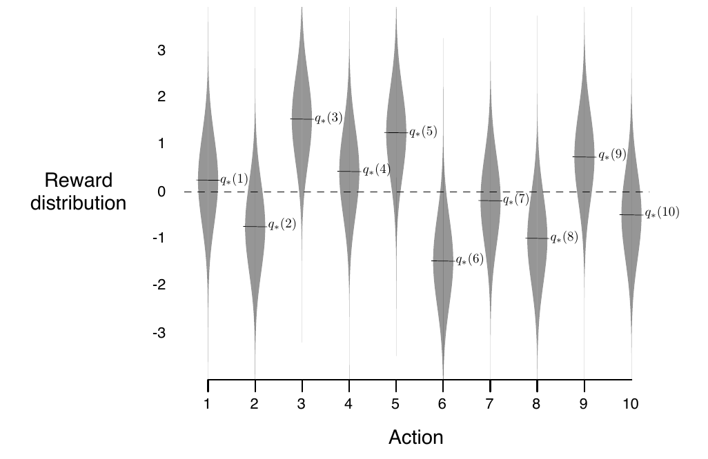

# 🎰 Bandits (Roletas)

  
## Resumo do Problema

Um dos problemas mais clássicos e simples em aprendizado por reforço é o problema do $k$-armed Bandit (em português, Roleta de $k$-alavancas). Nele uma inteligência artificial iria para um cassino e encontraria uma roleta com $k$ alavancas, lá ela teria que aprender - por meio de aprendizado por reforço - a escolher a alavanca que lhe da mais dinheiro.

  

## Especificando o Problema

Este problema pode ser generalizado para qualquer situação em que um agente é apresentado a um número $k$ de escolhas. Após cada escolha esse agente recebe uma recompensa dentro de uma **distribuição probabilística estacionária** baseado na ação escolhida. A imagem a seguir tenta ilustrar o problema:
  

No nosso problema de $k$-armed Bandit para cada das $k$ ações há uma recompensa média **esperada**; esse valor **esperado** geralmente é chamado de o **valor** da ação. Ou seja, definimos o **valor** de uma ação arbitrária $a$, denotado de $q_*(a)$, como uma recompensa em um tempo $t$ ($R_t$) dado que a ação em $t$ ($A_t$) foi $a$ como:

$q_*(a) = \mathop{\mathbb{E}}[R_t | A_t = a]$ (Esse $\mathop{\mathbb{E}}$ significa o valor esperado, é como se fosse a "recompensa média" - a recompensa com maior probabilidade de acontecer dado $a$.)

Se nosso agente soubesse todos os valores esperados, o problema seria facilmente resolvido: ele simplesmente escolheria a ação com o maior valor, o problema é  justamente que ele não sabe esses valores. E para descobri-los ele necessitará realizar o que chamamos de **exploração e explotação**.

Na **exploração** ele tentará conhecer melhor os valores de cada ação, para que na **explotação** ele já conheça uma variedade de valores diferentes e assim poderá escolher os melhores. Uma analogia com o mundo real seria o menu de um restaurante: imagine que você pediu um prato lá e acabou gostando deste prato, você poderia sempre pedi-lo quando fosse nesse restaurante e acabaria feliz, porém, se não se arriscar a pedir nenhum outro prato nuca saberá se pode haver um prato do qual você acabe gostando mais! 

## Estimando os $Q$-Valores

  

Como nosso agente não conhece os $q$-valores reais cabe a ele tentar estima-los de alguma maneira. Como estamos buscando um **valor esperado** - ou seja, a recompensa média - basta calcularmos a média das recompensas recebidas por nosso agente naquela ação:

$Q_{n+1} =\frac{1}{n} \sum_{i=1}^{n} R_i$

Porém, como na computação seria custoso executar uma somatória toda vez que gostaríamos de atualizar $Q$ podemos fazer algumas manipulações algébricas e cair na seguinte equação:

$Q_{n+1} = Q_n + \frac{1}{n}(R_n - Q_n)$

Que é a equação que utilizaremos em nosso algoritmos para estimar $Q$! Lembre-se que $n$ nesse caso vai ser o *número de vezes que aquela ação ocorreu*. Então teremos um $n$ para cada ação.

## Algoritmos Para Este Problema

[Algoritmo Guloso](Algoritmo%20Guloso) - Um algoritmo que só faz **explotação**.

[Algoritmo $\epsilon$-Guloso](Algoritmo%20Epsilon-Guloso) - Um algoritmo que mostra como **exploração** é importante.

[Algoritmo com UCB](Limite%20de%20Confiança%20Superior) - Um algoritmo que utiliza um parâmetro de **confiança** para **explorar e explotar**.

[Algoritmo de Softmax]() - :construction_worker: :construction:

[Algoritmo de Eliminação Média]() - :construction_worker: :construction:
