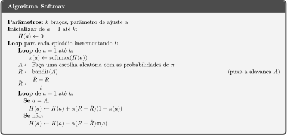

# 🎯 Algoritmo com Softmax
Veja a implementação do algoritmo no [notebook!](softmax.ipynb)

## Ideia do Algoritmo

Nos outros algoritmos de Bandits tivemos métodos que estipulavam o valor *Q* das ações do agente, o qual utilizava esses valores para tomar suas ações. Por mais que este seja um método bem eficaz, ele não é único. Este algoritmo tem como finalidade usar um parâmetro de *preferência H*t(*a*) (preferência estimada da ação *a* no tempo *t*). Quanto maior essa preferência maior será a probabilidade do agente tomar essa ação.

Para transformarmos esses valores de preferência em valores probabilísticos, utilizamos a função *Softmax*:

Aqui também vemos a utilização de uma notação bem utilizada em Aprendizado Por Reforço a *&pi;t*(*a*), que significa a probabilidade da ação *a* no tempo *t*.

## Entendendo a Função

Se você já estudou outras áreas de Aprendizado de Máquina já deve ter se deparado com a função *Softmax*. O que ela basicamente faz é receber um vetor (lista) de valores numéricos e os transforma em valores probabilísticos. Em outras palavras, quanto maior for o valor da *preferência* daquela ação, depois que essa lista de valores passar pela função *Softmax*, maior será a probabilidade do agente escolher aquela ação.

Isso se deve pois os valores de preferência *Ht*(*a*) estão sendo elevados pela função exponencial (ou seja,  valores grandes de *Ht*(*a*) ficam ainda mais prováveis) e sendo divididos pela soma desses exponenciais, normalizando os valores e transformando a soma deles em 1, assim, transformando-os em probabilidades.

## Atualizando as preferências *H*

Como não estamos usando mais a estimação de *Q* valores, não podemos usar a mesma função para atualizar as preferências *H*. Para essa função utilizamos a ideia de **Método do Gradiente** com um parâmetro definido pelo usuário _**&alpha;**_, que serve para controlar o quanto o algoritmo ajustara os valores das preferências *H*.

 e para todo *a* ≠ *At*

 é a média das recompensas até o tempo *t*.

## Pseudo Código do Algoritmo

