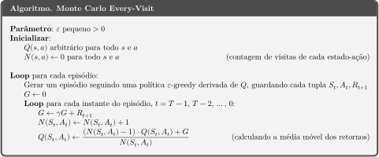

# 🏔 Monte Carlo Every Visit

**Monte Carlo Every-Visit** é um algoritmo de controle por Monte Carlo, ou seja, ele estima nossa função de valor *q(s, a)* a partir dos retornos médios de cada par estado-ação, e toma ações no ambiente com base nessas estimativas. 

Entretanto, esse algoritmo difere de outros métodos de Monte Carlo por utilizar todos os retornos de um par estado-ação durante um episódio. Isso significa que, quando o nosso agente visita um estado repetido e toma uma mesma ação, o cálculo da função de valor levará em conta o retorno de todas as vezes que essa ação foi tomada.

## Política ε-greedy

Para garantir que os métodos de Monte Carlo convirjam para a função de valor real, é necessário seguir uma política que explore todas as ações de todos os estados. Entretanto, também é interessante que o agente tente conseguir cada vez mais recompensas, para maximizar sua perfomance.

Assim foi desenvolvida a política *ε-greedy*, que escolhe a próxima ação com base em um parâmetro *ε*, normalmente pequeno. A cada decisão, a política tem uma probabilidade *ε* de escolher uma ação aleatória, aumentando a exploração, e uma probabilidade *1 - ε* de escolher a ação associada ao maior *Q*. Dessa forma, ela estabelece um equilíbrio entre a exploração de ações e a explotação de recompensas. Essa política é dada por:

## Algoritmo

Primeiramente, devemos inicializar a nossa tabela *Q(s, a)* com valores arbitrários para cada par estado-ação. Nesse caso, vamos optar por superestimar os valores Q de modo a incentivar a exploração do agente.

Também inicializamos uma tabela *N(s, a)* que guarda a quantidade de retornos obtidos de cada par estado-ação, para fazer o cálculo da média móvel dos retornos.

Para cada episódio, vamos escolher ações seguindo nossa política ε-greedy e guardar os estados, ações e recompensas para cada instante *t*. Ao final, calculamos o retorno *G* de cada instante começando pelo término atualizando os valores *Q* correspondentes.

Para estimar a média dos retornos, podemos utilizar a *média móvel*, de forma a realizar os cálculos na hora sem precisar guardar uma lista com todos os retornos. Ao invés disso, precisamos guardar apenas a média anterior e a quantidade total de elementos *n*.

Por fim, podemos ver abaixo um exemplo em pseudo-código do funcionamento do algoritmo de Monte Carlo Every-Visit:

