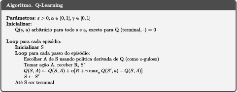

# Algoritmo de Q-Learning

O algoritmo de Q-Learning é um dos algoritmos do grupo TD (Temporal difference, diferença temporal), que estimam a função de valor por meio de uma estimativa a partir de outra estimativa, processo chamado _bootstrapping_

## Motivação

Assim como nos métodos de Monte Carlo, os métodos TD tem vantagens sobre os métodos de Programação Dinâmica (DP) por não dependerem de um modelo do ambiente para seu funcionamento, sendo capazes de aprender diretamente com a experiência

No entanto, os métodos TD têm uma vantagem sobre os métodos de Monte Carlo (MC), pois são capazes de aprendizado _online_, ou seja, aprendem com a passagem do episódio, enquanto os métodos de MC precisam chegar no final do episódio para iniciar o aprendizado. Em episódios longos ou em ações contínuas, sem episódios, os métodos MC se tornam inviáveis.

## Teoria

O objetivo do algoritmo é encontrar a função de *Valor Estado-Ação* da política ótima, ou seja, a função que melhor representa os valores *q* para cada par estado-ação do ambiente. A equação da função se encontra abaixo, onde o valor q é dado pelo valor esperado do retorno G, dado um par estado-ação:

O algoritmo de Q-Learning é extremamente versátil dentro dos métodos TD, por ser um algoritmo _off-policy_, ou seja, seu aprendizado não depende da política que está sendo seguida, diferente de outros métodos TD, como SARSA. Com isso, o treinamento é acelerado, pois só depende que os pares estado-ação sejam visitados.

## Política

A política adotada é a chamada ε-greedy (ε-guloso). Um número aleatório no intervalo entre 0 e 1 é comparado com ε. Se o número aleatório for menor do que o valor de ε, a ação tomada vai ser aleatória, de forma a explorar o ambiente. Caso contrário, a ação vai ser a que possui maior valor Q, de acordo com as estimativas atuais que o algoritmo possui. Dessa forma, o agente tomará uma ação aleatória com probabilidade ε.

## Algoritmo

O algoritmo consiste na atualização das estimativas dos valores Q(S, A) de acordo com a seguinte expressão:

De forma resumida, o valor Q(S,A) é atualizado fazendo uma "correção" com "taxa de aprendizado" &alpha;, considerando a recompensa R recebida com a escolha da ação e a ação futura que maximiza o valor Q do próximo estado (S'), descontada de um fator &gamma;. É interessante ressaltar que todas as atualizações são feitas com as estimativas, tanto do presente quanto do futuro, que vão se aprimorando até se aproximar da função q da política ótima.

O funcionamento do algoritmo ao longo dos episódios pode ser visto no pseudocódigo a seguir:

